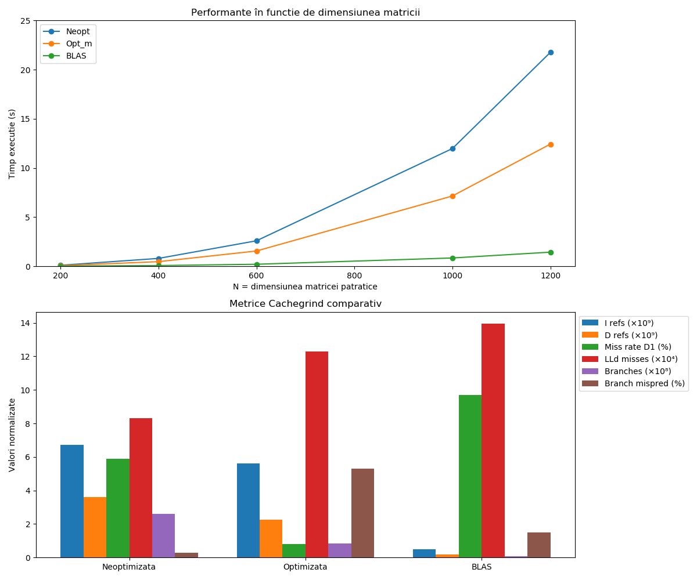

# 🚀 Tema 3: Optimizari

**Nume: Lemnaru Mihai-Daniel**
**Grupa: 331CD**

---

## 📘 Descriere
Optimizarea unor succesiuni de calcul cu matrici

## 🛠️ Implementare
**Neoptimizata:**
- Am alocat memorie pentru matricile temporare C si D (ambele de dimensiune N) si pentru vectorii x, y si *result*(de dimensiune N). Pentru C si D folosim `calloc`, ca sa ne asiguram ca sunt initialiate cu 0.
- Am facut o copie a vectorului x pentru a nu modifica vectorul initial.
- C = B · Aᵀ: Am calculat folosind 3 for-uri clasice pentru a calcula fiecare element `C[i,j]` ca suma produselor `B[i,k]` * `Aᵀ[k,j]`
- D = Cᵀ · A: Am calculat-o in mod similar 
- Pentru a implementa iteratia de N ori a celor 2 operatii am folosit 2 bucle in care am calculat : y[i] = ∑ C[k,i] * x[k], respectiv x[i] = ∑ C[i,k] * y[k], pe care le-am repetat de N ori
- La final am inmultit matricea D cu vectorul x, folosind din nou o bucla dubla, obtinand: result[i] = ∑ D[i,k] * x[k]

**Optimizata:**
- Am *pre-transpus matricile* pentru a nu mai accesa la fiecare iteratie A[j*N + k], ci construind o singura data o matrice transpusa
- Am utilizat tehnica de *blocking*. Memoria L1 este limitata si astfel impartind buclele mari in mici blocuri de dimensiune specificata (32) reducem amestecarea datelor intre for-uri si marim cache hit-rate.
- Totodata am utilizat si *loop unrolling* pentru a reduce overhead-ul for-ului respectiv (aceasta tehnica face mai putine salturi, dar depune mai mult efort per iteratie).
- Am folosit si *pointer arithmetics* pentru variabilele care sunt folosite intens in interiorul buclelor, acestea fiind stocate intr-un registru al procesorului si accelerand procesul de acces la respectivele variabile.

**Blas:**
- Am utilizat functiile `cblas_dgemm` si `cblas_dgemv` pentru a rezolva calculele date
- `cblas_dgemm` realizeaza inmultirea a doua matrici cu elemente de tip double. 
- cblas_dgemm(Order, TransA, TransB, M, N, K, alpha, A, lda, B, ldb, beta, C, ldc); 
    * Order: Modul de stocare al matricilor (CblasRowMajor pentru C)
    * TransA: Daca matricea A este transpusa (CblasNoTrans sau CblasTrans)
    * TransB: Echivalent cu TransA
    * M: Numarul de linii ale matricii A si C
    * N: Numarul de coloane ale matricii B si C
    * K: Numarul de coloane ale matricii A si de linii ale matricii B
    * alpha: Scalar cu care se inmulteste rezultatul A*B
    * A: Pointer la matricea A
    * lda: Leading dimension pentru A
    * B: Pointer la matricea B
    * db: Leading dimension pentru B
    * beta: Scalar cu care se inmulteste matricea C initiala
    * ldc: Leading dimension pentru C
- `cblas_dgemv` inmultirea matrice-vector cu elemente de tip double.
- cblas_dgemv(Order, TransA, M, N, alpha, A, lda, X, incX, beta, Y, incY);
    * incX: Incrementul pentru parcurgerea vectorului X (1 = elemente consecutive).

## 🔍 Analiza
*Valgrind* nu a gasit leak-uri in nici o implementare.
La rularea *valgrind* folosind *cachegrind* se pot observa:
| Varianta            |     I refs    |     D refs    | D1 miss rate | LLd misses |   Branches  | Mispredict rate | Time (s)
|---------------------|---------------|---------------|--------------|------------|-------------|-----------------|----------
| **Neoptimizata**    | 6 709 150 250 | 3 612 136 153 |     5.9 %    |   83 033   | 261 655 355 |      0.3 %      | 32.26
| **Optimizata**      | 5 609 373 607 | 2 253 321 174 |     0.8 %    |   123 009  | 82 289 891  |      5.3 %      | 26.37
| **Blas**            |  487 143 110  |  179 193 829  |     9.7 %    |   139 610  |  9 273 240  |      1.5 %      | 5.01

**Neoptimizata:**
- Se poate observa faptul ca in aceasta varianta procesorul executa si acceseaza un numar foarte mare de instructiuni (*I refs* -> instructiuni citite; *D refs* -> numar total de accesari de date)
- Valoarea de ~6 % din *D1 miss rate* indica faptul ca ~ 1 din 17 accesari de date nu gaseste elementul in L1, ceea ce explica si timpul ridicat
- Fluxul de control este simplu, deci procentul de ramificari la care procesorul a prezis gresit calea de executie este foarte buna (0.3%)

**Optimizata:**
- `I_refs`: 6709150250 − 5609373607 = 1099776643. 1099776643 / 6709150250 ≈ 0.1639
- `D_refs`: 3612136153 − 2253321174 = 1358814979. 1358814979 / 3612136153 ≈ 0.3762
- => Instructiunile citite (*I refs*) scad cu ~16 % si numarul total de accesari de date (*D refs*) scad cu ~38 % fata de varianta neoptimizata, din cazua *pre-transpunerilor matricilor* si a *pointerilor aritmetici*.
- Valoarea de sub 1 % din *D1 miss rate* se datoreaza in mare masura tehnicilor de *blocking* + *unrolling* folosite care aduc aproape toate datele in L1 si le refolosesc acolo -> mare parte din cache hits
- LLd misses sunt mai multe decat la varianta *Neoptimizata*, chiar daca *D1 miss rate* este semnificativ mai mic. Acest lucru se intampla, deoarece desi datele sunt mai bine gestionate in L1, atunci cand nu se gasesc acolo, accesele sunt mai concentrate si pot ajunge mai des la ultimul nivel de cache.
- Mispredict rate-ul este mai mare decat la varianta *Neoptimizata*, deoarece *unrolling-ul* introduce mai multe ramificatii pe bucla, dar totusi costul este compensat de eficienta crescuta a accesului la date din cache

**Blas:**
- Scaderea drastica a numarului de instructiuni ne arata, asa cum ne-am astepta, ca libraria *BLAS* este foarte optimizata (multithreading, SIMD, etc.)
- *D1 miss rate* ~10 % inseamna ca *BLAS* incarca un volum extrem de mare de date, dar foloseste L2/L3 inteligent (*LLd miss rate* 0.1 %)
- Cel mai mic numar de *branches* si *misspredicts* datorita buclelor vectorizate generate automat

**Performanta comparativa:**

- Am ales sa testez pentru N cu valorile de 200, 400, 600, 1000, 1200, astfel incat sa am o plaja de testare mai mare (cu un N mai mic = 200 si unul mai mare = 1200)

In acest grafic sunt comparate timpii de executie pentru cele trei variante:
- Observam ca pe masura ce N creste, varianta *Neoptimizata* are o crestere aproape cubica a timpului (de la 0.096525 s la N = 200 la 21.755663 s la N = 1200)
- Varianta *Optimizata* reuseste sa reduca semnificativ coeficientul constant al acestei cresteri (timpul pentru N = 1200 scade la 12.421175 s)
- *BLAS* arata clar ca rutinele extrem de optimizate (folosind SIMD, prefetching, multithreading intern) ofera cei mai buni timpi (La N=1200 ruleaza in 1.430622 s, comparativ cu ~12.4 s -> opt_m si ~21.8 s -> neopt)

**Observatie:**
- In enuntul problemei, bucla de dimensiune N care alterneaza intre `y = Ct * x` si `x = C * y` simuleaza o relaxare iterativa, un proces intalnit in *metode numerice* (ex: Jacobi, Gauss-Seidel). Aceasta relaxare reprezinta actualizarea treptata a solutiei pana la convergena (rezultatul se stabilizeaza cu eroarea sub un anumit prag). 

## 📝 Explicatie prompturi LLMs:
Am utilizat un workflow treptat pentru a obtine de la ChatGPT un cod functional.
- Pentru varianta *neoptimizata* si *BLAS* a reusit sa imi dea un cod simplu si functional
- Varianta *optimizata* nu a reusit sa mi-o optimizeze foarte bine fapt pentru care am adaugat la varianta data:
    * pre-transpunerea matricelor (2 matrici auxiliare transposeA si transposeC calculand o singura data Aᵀ si, ulterior, Cᵀ inainte de a le folosi in bucle)
    * copierea mai rapida a vectorului initial (in loc de for am facut cu memcpy, care foloseste instructiuni vectoriale)
    * loop unrolling (am adaugat o faza care proceseaza 4 elemente odata `for (; j+3 < …; j+=4)`)

## 📚 Resurse utilizate:
- Laboratorul 09 - Tehnici de Optimizare de Cod – Inmultirea Matricelor
- Cursuri APM: 
    * Sistemul de memorie: https://ocw.cs.pub.ro/courses/apm/cursuri/01
    * Memoria Cache: https://ocw.cs.pub.ro/courses/apm/cursuri/02
- Documentatie:
    * cblas: 
        * https://www.netlib.org/lapack/explore-html/de/da0/cblas_8h_af7c57c72392e65dd258f8865d8d2a914.html
        * https://www.netlib.org/lapack/explore-html/de/da0/cblas_8h_af7c57c72392e65dd258f8865d8d2a914.html
    * cachegrind: https://valgrind.org/docs/manual/cg-manual.html

## Observatii generale:
Tema a fost foarte bine explicata, pasii fiind clari si usor de urmarit.

### 🔗 GitHub
Link repo: https://github.com/PXrotters/Matrix-Optimizations